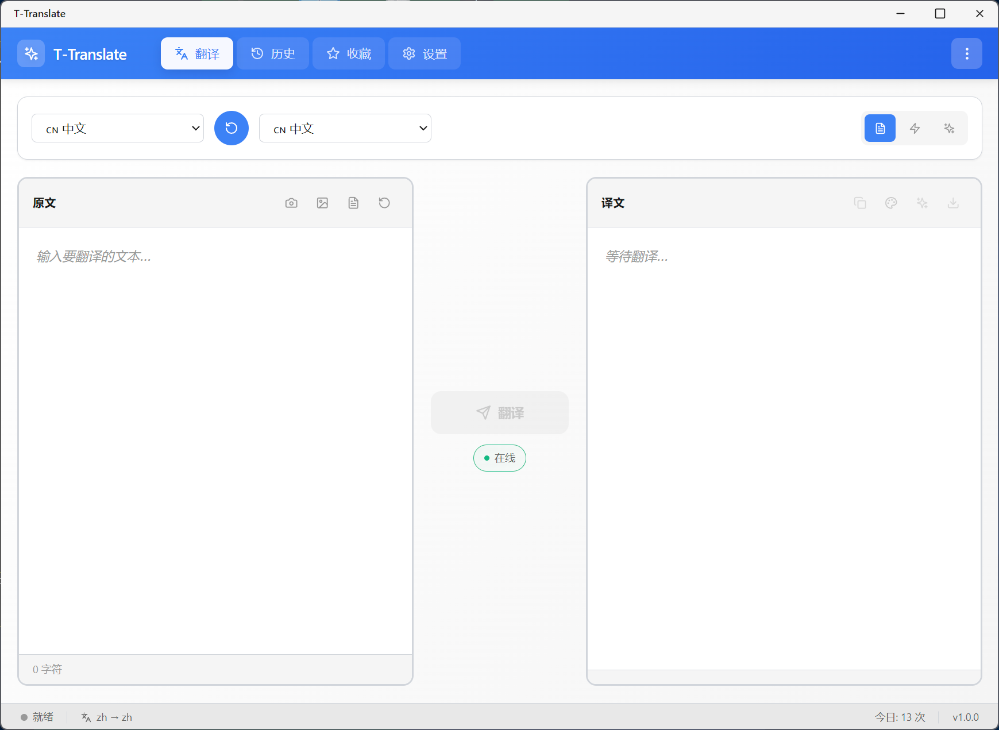
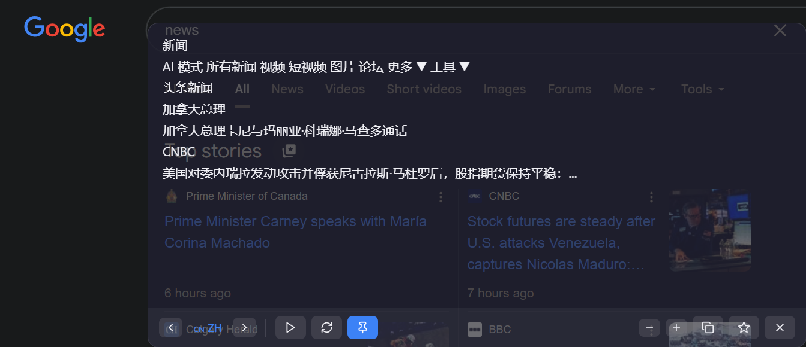
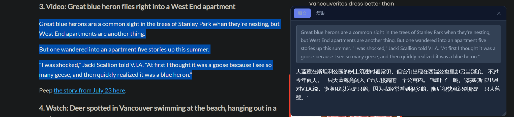
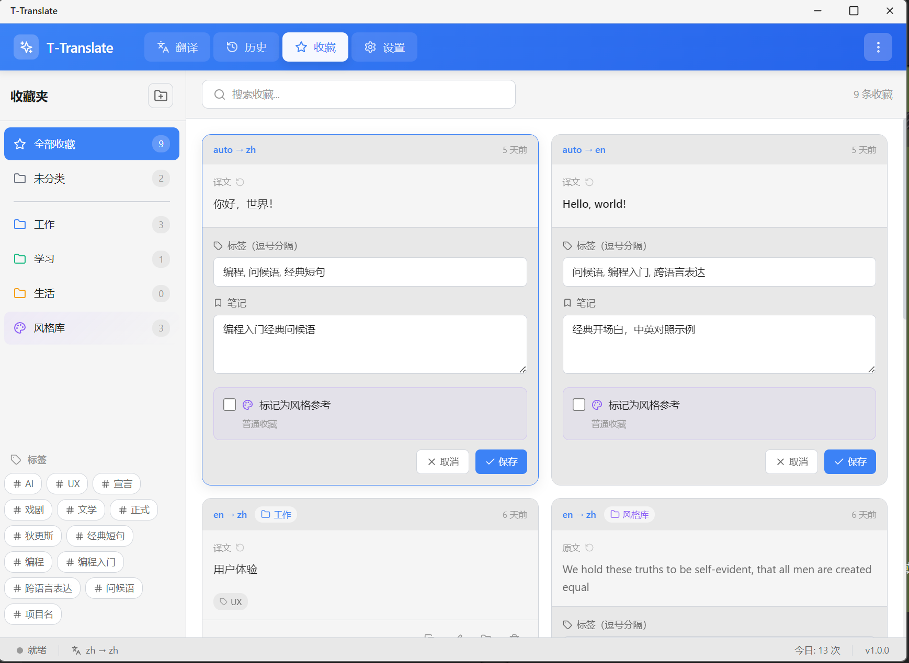
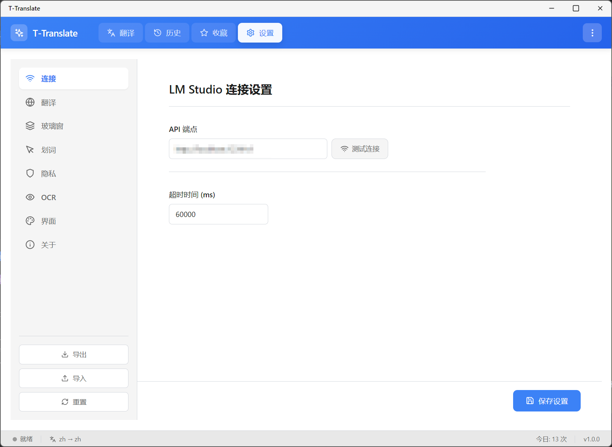

# T-Translate

<p align="center">
  
</p>

<p align="center">
  <b>一款注重隐私的本地 AI 翻译工具</b>
</p>

<p align="center">
  
  
  
  
</p>

---

## 📖 简介

**T-Translate** 是一款基于本地大语言模型的桌面翻译工具。所有翻译请求都在本地处理，无需联网，确保您的隐私安全。

在 QTranslate 停止更新的背景下，结合大模型时代的技术红利，T-Translate 旨在提供一个**现代化、注重隐私、功能丰富**的翻译解决方案。

## ✨ 特性

### 🔒 隐私优先

- **完全本地化** - 所有翻译由本地 LLM 完成，数据不出设备
- **无需联网** - 离线可用，无隐私泄露风险
- **开源透明** - 代码完全开放，可自行审查

### 🎯 三种翻译模式

| 模式         | 说明                           | 适用场景             |
| ------------ | ------------------------------ | -------------------- |
| **主窗口**   | 传统翻译界面，输入文本获取翻译 | 长文本翻译、精细编辑 |
| **玻璃窗口** | 置顶透明窗口，实时翻译         | 看视频、对照阅读     |
| **划词翻译** | 选中文字即时翻译               | 浏览网页、阅读文档   |

### 🤖 AI 增强功能

- **智能标签** - AI 自动为收藏内容生成分类标签
- **上下文理解** - LLM 理解语境，翻译更准确
- **多语言检测** - 自动识别源语言

### 💡 其他亮点

- **收藏管理** - 带 AI 标签的收藏系统，快速检索
- **历史记录** - 翻译历史自动保存，支持搜索
- **OCR 识别** - 截图识别文字，图片也能翻译
- **深色模式** - 支持亮色/深色主题切换
- **系统托盘** - 后台运行，随时唤起

## 📸 截图

### 主窗口



### 玻璃窗口



### 划词翻译



### 收藏管理



### 设置面板



## 🚀 快速开始

### 环境要求

- **操作系统**: Windows 10/11
- **本地 LLM**: [LM Studio](https://lmstudio.ai/) 或兼容 OpenAI API 的服务
- **推荐模型**: Qwen3-VL 或其他支持中英翻译的模型

### 安装步骤

1. **下载并安装 LM Studio**

   - 访问 [lmstudio.ai](https://lmstudio.ai/) 下载
   - 安装后下载翻译模型（推荐 Qwen3-VL）
   - 启动本地服务器（默认端口 1234）

2. **下载 T-Translate**

   ```bash
   # 克隆仓库
   git clone https://github.com/yourusername/t-translate.git
   cd t-translate

   # 安装依赖
   npm install

   # 启动应用
   npm run dev
   ```

3. **配置连接**
   - 打开设置 → 连接
   - 确认 API 地址为 `http://localhost:1234/v1`
   - 点击「测试连接」

### 打包发布

```bash
# 构建生产版本
npm run build

# 打包 Windows 安装程序
npm run package
```

## ⌨️ 快捷键

| 快捷键             | 功能            |
| ------------------ | --------------- |
| `Ctrl + Shift + T` | 打开/隐藏主窗口 |
| `Ctrl + Shift + G` | 打开玻璃窗口    |
| `Ctrl + Shift + S` | 截图 OCR        |
| `Esc`              | 关闭当前窗口    |

_划词翻译：选中文字后点击出现的翻译按钮_

## 🏗️ 技术架构

```
T-Translate
├── Electron (桌面框架)
│   ├── 主进程 (main.js)
│   │   ├── 窗口管理
│   │   ├── 系统托盘
│   │   ├── 全局快捷键
│   │   ├── 划词监听 (uiohook-napi)
│   │   └── IPC 通信
│   │
│   └── 渲染进程 (React)
│       ├── 主窗口 (翻译、历史、收藏)
│       ├── 玻璃窗口 (置顶翻译)
│       └── 划词窗口 (便利贴式翻译)
│
├── 本地 LLM (LM Studio)
│   └── OpenAI 兼容 API
│
└── 数据存储 (electron-store)
    ├── 设置
    ├── 历史记录
    └── 收藏夹
```

## 📁 项目结构

```
t-translate/
├── electron/
│   ├── main.js              # 主进程
│   ├── preload.js           # 主窗口预加载
│   ├── preload-glass.js     # 玻璃窗口预加载
│   └── preload-selection.js # 划词窗口预加载
├── src/
│   ├── components/
│   │   ├── TranslatorPanel.jsx   # 翻译面板
│   │   ├── HistoryPanel.jsx      # 历史记录
│   │   ├── FavoritesPanel.jsx    # 收藏夹
│   │   ├── SettingsPanel.jsx     # 设置
│   │   ├── GlassWindow.jsx       # 玻璃窗口
│   │   └── SelectionTranslator.jsx # 划词翻译
│   ├── styles/
│   └── App.jsx
├── public/
│   ├── index.html
│   ├── glass.html
│   └── selection.html
└── package.json
```

## 🔄 与其他工具对比

| 功能       | T-Translate     | QTranslate | 有道词典 | DeepL |
| ---------- | --------------- | ---------- | -------- | ----- |
| 本地翻译   | ✅ 完全本地     | ❌         | ❌       | ❌    |
| 隐私保护   | ✅ 数据不出设备 | ⚠️         | ❌       | ⚠️    |
| 划词翻译   | ✅              | ✅         | ✅       | ✅    |
| AI 标签    | ✅              | ❌         | ❌       | ❌    |
| 玻璃窗口   | ✅              | ❌         | ❌       | ❌    |
| 开源免费   | ✅              | ✅         | ❌       | ❌    |
| 自定义模型 | ✅              | ❌         | ❌       | ❌    |
| 持续更新   | ✅              | ❌ 已停更  | ✅       | ✅    |

## 🛣️ 路线图

### 已完成 ✅

- [x] 主窗口翻译
- [x] 玻璃窗口
- [x] 划词翻译
- [x] OCR 截图识别
- [x] 收藏夹 + AI 标签
- [x] 历史记录
- [x] 设置面板
- [x] 深色模式

### 计划中 📋

- [ ] 多显示器优化
- [ ] 自动更新
- [ ] 更多语言支持
- [ ] 词典模式（单词详解）
- [ ] macOS 支持
- [ ] 插件系统

## 🤝 贡献

欢迎提交 Issue 和 Pull Request！## 📮 联系方式

- **GitHub Issues**: [报告问题](https://github.com/Tianao0110/T-Translate/issues)
- **Email**: Edanzeng0110@outlook.com

## 📄 许可证

[MIT License](LICENSE)

---

<p align="center">
  <b>用 ❤️ 构建</b>
  <b>如果这个项目对你有帮助，请给一个 ⭐ Star！</b>
</p>
