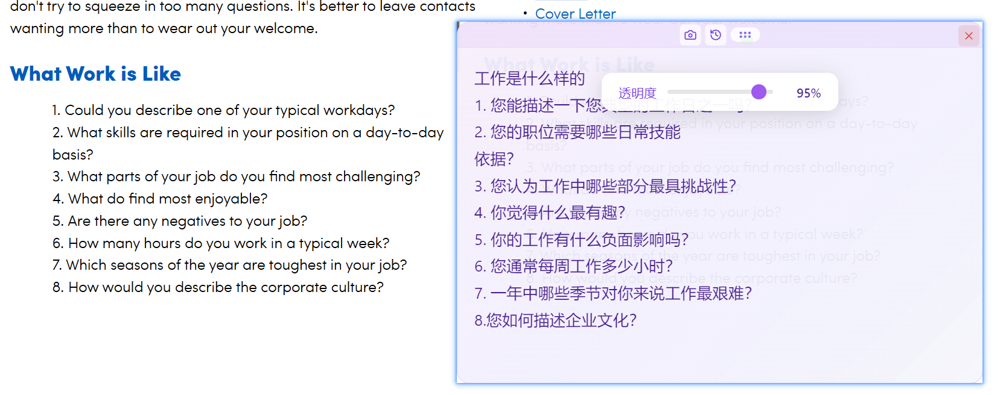
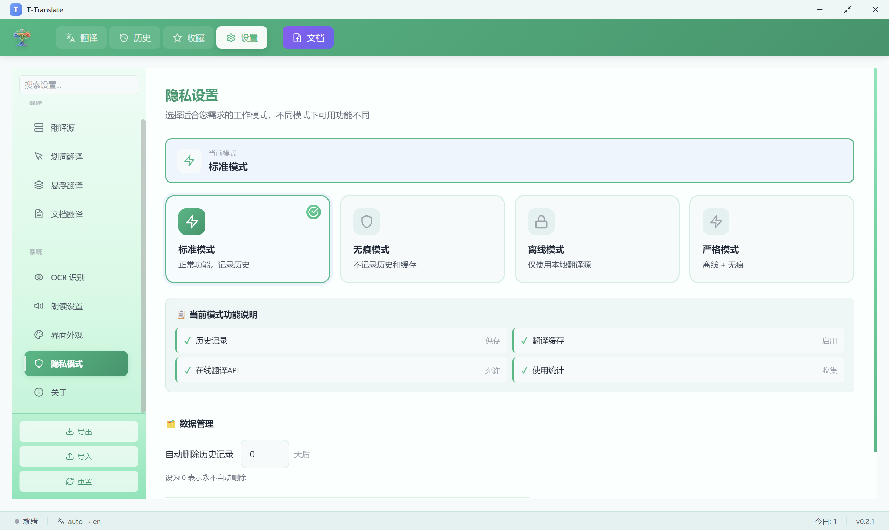

# T-Translate

<p align="right">
  English | <a href="./README.zh-CN.md">简体中文</a>
</p>

<p align="center">
  
</p>

<p align="center">
  <strong>On-demand translation, privacy by default</strong><br>
  Select to translate · Screenshot to translate · Local LLM first · API keys encrypted at rest
</p>

<p align="center">
  
  
  
</p>

---

## Features

| Feature | Description |
| --- | --- |
| **Selection translator** | System-wide. Select text in any app to translate. Up to 8 pinned windows |
| **Screenshot OCR** | Capture screen regions. 6 OCR engines with automatic fallback |
| **Glass overlay** | Transparent overlay. Space-bar to capture-and-translate. For complex layouts |
| **Document translation** | 9 formats: PDF / DOCX / EPUB / TXT / SRT / VTT / CSV / JSON / Markdown. Segment-by-segment, resumable |
| **Glossary** | Auto-replace terms after translation, with undo support |
| **TTS** | Built on Windows offline speech engine |
| **10 translation providers** | LM Studio, Ollama, OpenAI, Claude, Gemini, DeepSeek, DeepL, Google, Microsoft, Baidu |
| **4 privacy modes** | Standard / Offline / Incognito / Strict. Offline mode blocks decryption of online API keys |
| **Auto-start** | Silent tray launch with optional auto-enable for selection translator |

---

### Selection translator

Select any text and a translation window pops up automatically. Up to 8 pinned windows can stay open at once. Source language is detected automatically.

<p align="center">
  
</p>

### Screenshot OCR translation

Capture a screen region for text recognition. When an OCR engine is unavailable, falls back to the next one transparently.

<p align="center">
  
</p>

### Glass overlay

Transparent overlay window for live translation. Drag, resize, pin on top. Spawn independent child panes. Space-bar / left-click acts as a toggle: with content → clear, without content → screenshot-and-translate. Child window opacity is independent of the parent, always readable.

<p align="center">
  
</p>

### Document translation

Supports 9 formats: PDF, DOCX, EPUB, TXT, SRT, VTT, CSV, JSON, Markdown. Batch mode and glossary integration. Translation time varies by device and provider.

<p align="center">
  
</p>

### Privacy modes

Four levels of privacy control. In offline / strict modes, only local LLMs are used. Online API keys are blocked from decryption even if internal code attempts to access them.

<p align="center">
  
</p>

### Multi-provider

10 providers: local LLM (LM Studio / Ollama), OpenAI, Anthropic Claude, Gemini, DeepSeek, DeepL, Google Translate, Microsoft Translator, Baidu Translate. Switch freely, drag to reorder, set priority. On failure, falls back to the next available provider automatically.

<p align="center">
  
</p>

### TTS

Speak translation results aloud using Windows' offline speech engine. Rate adjustable. Voice list reflects locally installed speech packs.

<p align="center">
  
</p>

---

## Quick start

Download an installer from [Releases](https://github.com/Tianao0110/T-Translate/releases), or build from source:

```bash
git clone https://github.com/Tianao0110/T-Translate.git
cd T-Translate
npm install
npm start        # dev mode
npm run dist     # build installer
```

---

## Keyboard shortcuts

| Shortcut | Action |
| --- | --- |
| `Ctrl+Shift+T` | Show / hide main window |
| `Ctrl+Shift+S` | Screenshot translate |
| `Ctrl+Shift+G` | Open glass overlay |
| `Ctrl+Shift+D` | Toggle selection translator |
| `Ctrl+Enter` | Run translation |

*Shortcuts are customizable in Settings.*

---

## Security & Privacy

Privacy is a core design principle:

- **Local-first** — Local LLM is the top priority. Fully usable offline
- **Encrypted at rest** — API keys encrypted via Windows DPAPI. No plaintext fallback
- **Access audit** — Every decryption operation is logged. Abnormal frequency triggers alerts
- **Privacy interlocks** — Offline / strict modes block decryption of online API keys
- **Least privilege** — Each window has its own preload script exposing only the APIs it needs
- **No axios** — Unaffected by recent npm supply chain attacks

---

## 📁 Project structure

```
t-translate/
├── electron/               # Main process
│   ├── main.js             # Entry point
│   ├── preloads/           # Preload scripts (per-window isolation)
│   ├── shared/             # Shared constants and config
│   ├── ipc/                # IPC handlers (with secure-storage audit)
│   ├── managers/           # Window / tray / menu managers
│   └── utils/              # Native utilities (Win32 API, state machines)
│
├── src/                    # Renderer process
│   ├── components/         # React components
│   ├── providers/          # Translation providers (10)
│   ├── services/           # Service layer (translation, cache, pipeline)
│   ├── stores/             # Zustand state management
│   ├── config/             # Config (privacy modes, templates, constants)
│   └── i18n/               # i18n (zh / en, 1000+ keys each)
│
├── public/                 # HTML entry + static assets
├── resources/              # App resources (OCR training data)
├── scripts/                # Utility scripts
└── docs/                   # Project documentation
```

## 🏗️ Tech stack

| Category | Technology |
| --- | --- |
| Framework | Electron 28 + React 18 |
| Build | Vite 5 |
| State | Zustand + Immer |
| Styling | CSS Variables |
| Secure storage | Electron safeStorage (Windows DPAPI) + access audit |
| OCR | RapidOCR / Windows OCR / LLM Vision / Google Vision / Azure / Baidu |
| Local LLM | LM Studio / Ollama (OpenAI-compatible API) |
| Online translation | OpenAI / Claude / Gemini / DeepSeek / DeepL / Google / Microsoft / Baidu |
| Packaging | electron-builder |

More docs under `docs/`: [Architecture](docs/ARCHITECTURE.md) · [Development guide](docs/DEVELOPMENT.md) · [i18n guide](docs/I18N_GUIDE.md) · [Theme customization](docs/THEME_CUSTOMIZATION.md)

---

## Contributing

Issues and pull requests are welcome.

---

## License

[MIT License](LICENSE)

---

<p align="center">
  Made with ❤️ by <a href="https://github.com/Tianao0110">Tianao</a>
</p>
