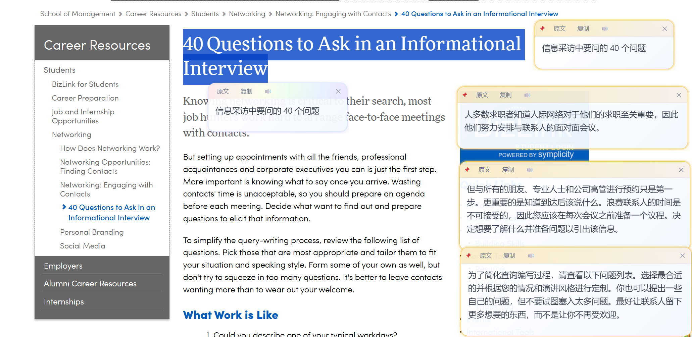
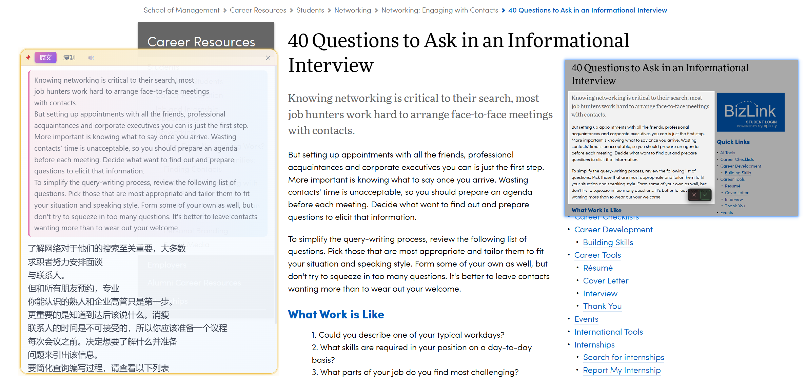
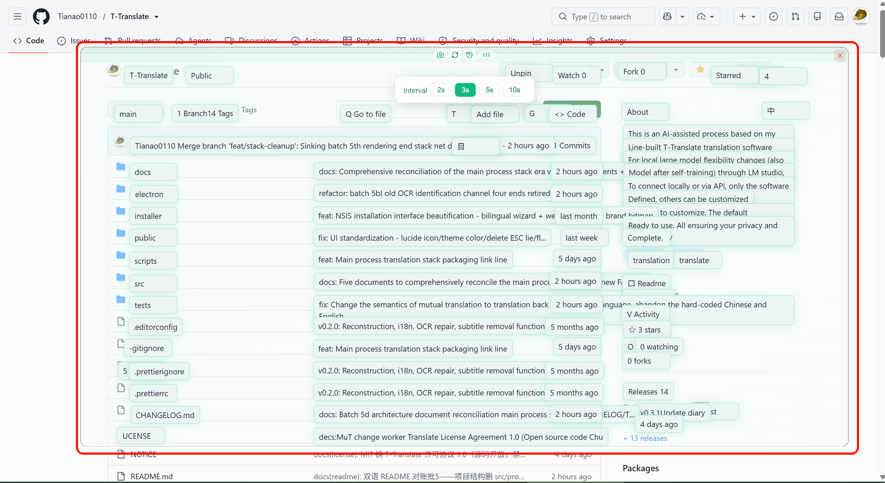
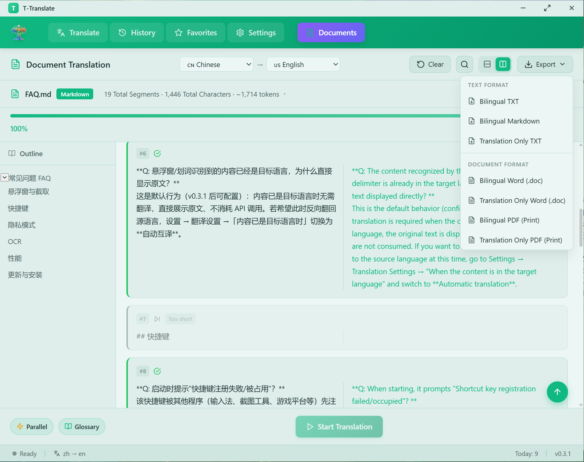
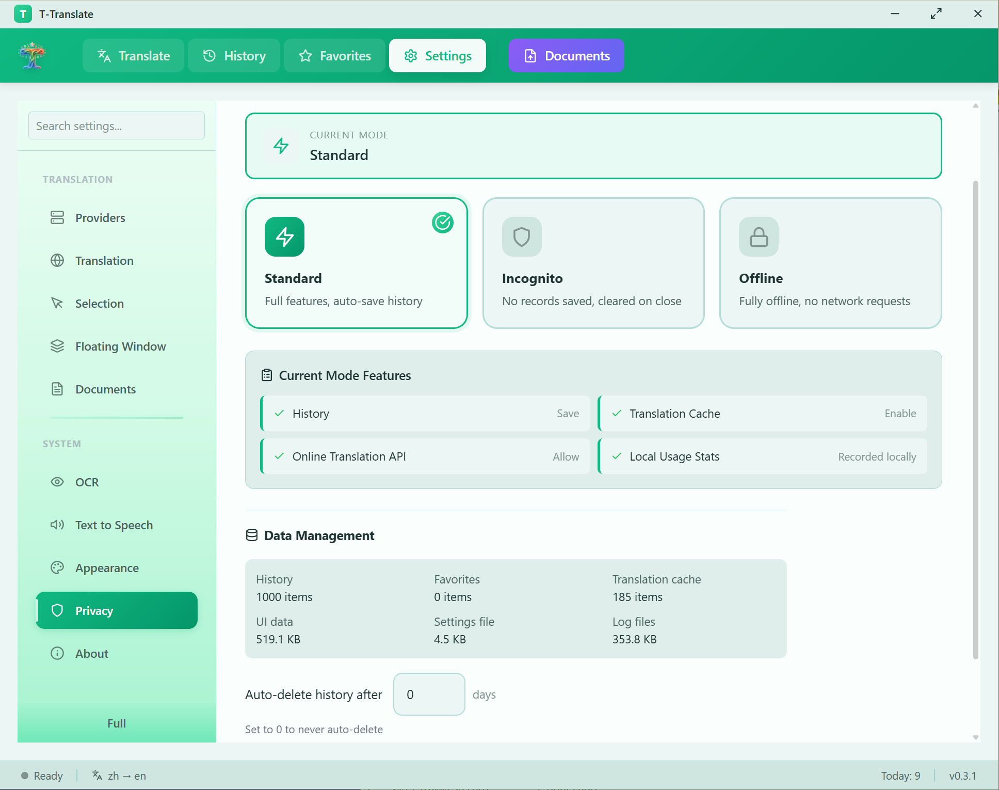
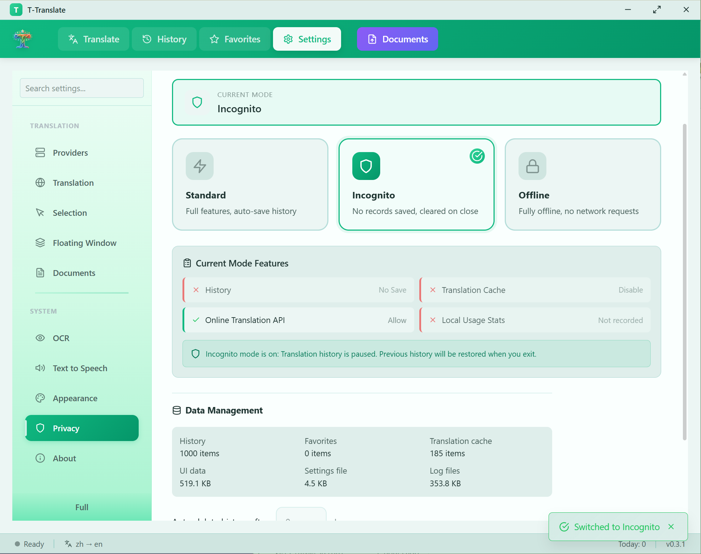
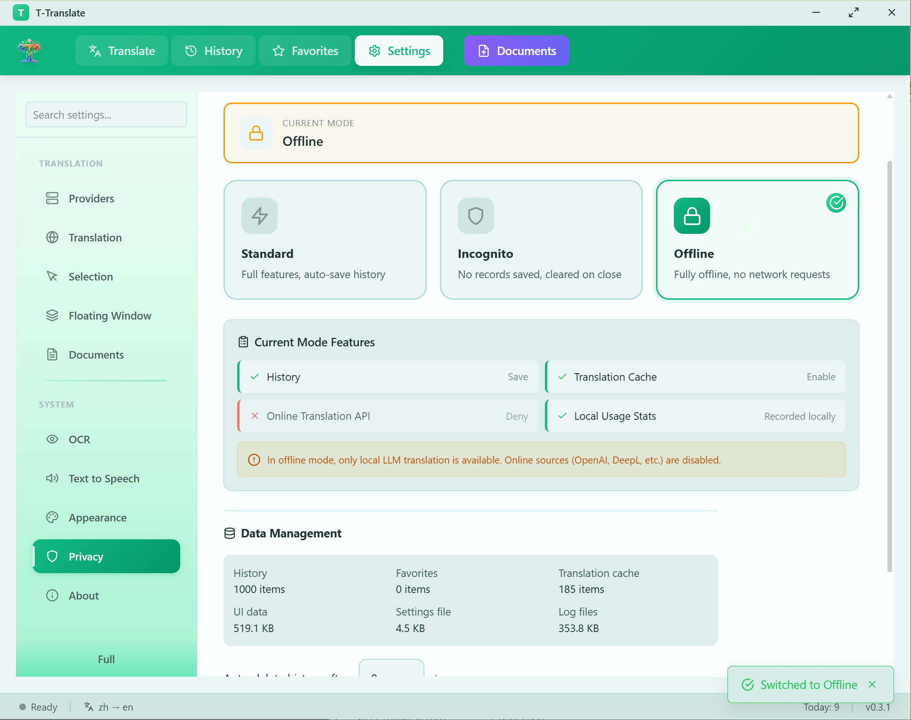
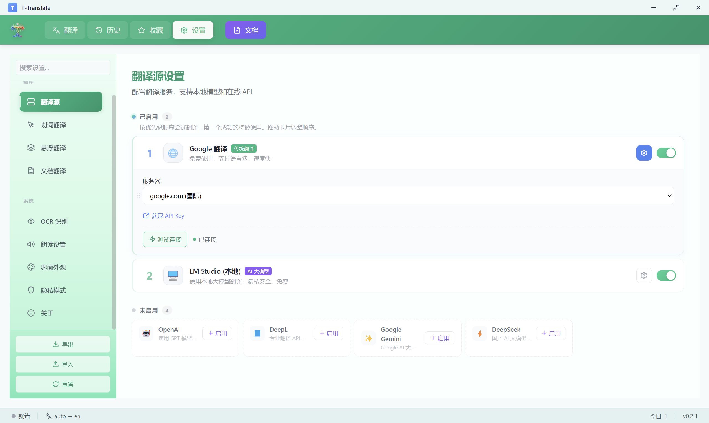
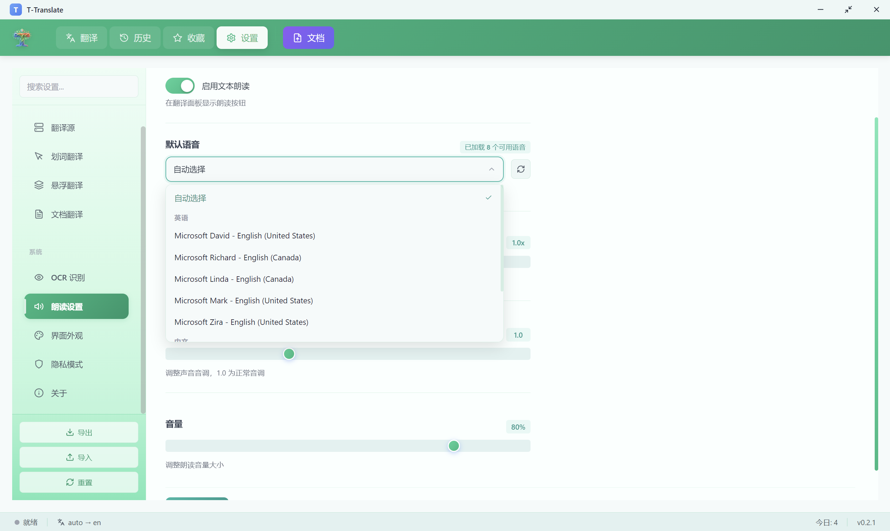

# T-Translate

<p align="right">
  <a href="./README.md">English</a> | 简体中文
</p>

<p align="center">
  
</p>

<p align="center">
  <strong>随手翻译，隐私无忧</strong><br>
  划词即译 · 截图即译 · 本地 LLM 优先 · API Key 加密存储
</p>

<p align="center">
  
  
  
</p>

---

## 功能一览

| 功能                   | 说明                                                                                |
| ---------------------- | ----------------------------------------------------------------------------------- |
| **划词翻译**     | 系统级，任何应用中选中文字即翻译，支持 8 个冻结窗口                                 |
| **截图 OCR**     | 截屏识别文字，7 个 OCR 引擎自动降级                                                 |
| **悬浮窗口**     | 透明悬浮窗，空格截图翻译；自动刷新与全局快捷键零焦点截取，实时字幕/追番适用         |
| **文档翻译**     | PDF / DOCX / EPUB / TXT / SRT 等 9 种格式，逐段翻译，进度可恢复                     |
| **术语库**       | 翻译后自动替换术语，支持撤销                                                        |
| **TTS 朗读**     | 基于 Windows 离线语音引擎                                                           |
| **10 个翻译源**  | LM Studio、Ollama、OpenAI、Claude、Gemini、DeepSeek、DeepL、Google、Microsoft、百度 |
| **三档隐私模式** | 标准 / 无痕 / 离线，离线模式下在线 API Key 禁止解密                                 |
| **开机自启**     | 静默运行到托盘，可选自动开启划词翻译                                                |

---

### 划词翻译

选中任意文字自动弹出翻译窗口，支持最多 8 个冻结窗口同时显示，智能检测源语言。

<p align="center">
  
</p>

### 截图 OCR 翻译

截取屏幕区域进行文字识别，引擎不可用时自动降级到下一个，使用无感。

<p align="center">
  
</p>

### 悬浮窗口

透明悬浮窗实时翻译，支持拖拽、缩放、置顶，可创建多个独立子面板。空格键/左键 Toggle：有内容清空，无内容截图翻译。子窗口透明度独立于父窗口，始终清晰可读。

**零焦点截取**：自动刷新（工具栏选间隔 2/3/5/10 秒循环截译，内容不变零开销）与全局快捷键 `Ctrl+Alt+Space` 重截，全程不抢焦点——目标应用保持前台，实时字幕/视频字幕不会因失焦消失。（提示：Teams「弹出字幕窗口」自带系统级反截屏，把字幕固定在会议窗口内即可正常截取。）

<p align="center">
  
</p>

### 文档翻译

支持 PDF、DOCX、EPUB、TXT、Markdown、SRT、VTT、CSV、JSON 共 9 种格式。支持并发翻译、扫描件 OCR 和术语库联动。等待时间因设备性能和翻译源而异。

<p align="center">
  
</p>

### 隐私模式

三档隐私控制，按需选择。离线模式下仅使用本地 LLM，在线 API Key 禁止解密——即使程序内部被恶意代码调用也拿不到。

<p align="center">
    
  
  
</p>

### 多翻译源

支持本地 LLM（LM Studio / Ollama）、OpenAI、Anthropic Claude、Gemini、DeepSeek、DeepL、Google 翻译、Microsoft 翻译、百度翻译共 10 个翻译源，可自由切换、拖拽排序、设置优先级。翻译失败自动切换到下一个可用源。

<p align="center">
  
</p>

### TTS 朗读

翻译结果语音朗读，基于 Windows 离线语音引擎，可调节语速。语音列表根据系统已安装的离线语音包加载。

<p align="center">
  
</p>

---

## 快速开始

从 [Releases](https://github.com/Tianao0110/T-Translate/releases) 下载安装包，或从源码构建：

```bash
git clone https://github.com/Tianao0110/T-Translate.git
cd T-Translate
npm install
npm run ocr:models   # 拉取本地 OCR 基础模型（一次性，~19MB）
npm start            # 开发模式
npm run dist         # 打包安装程序（自动含上一步）
```

---

## 快捷键

| 快捷键           | 功能              |
| ---------------- | ----------------- |
| `Alt+Q`        | 截图翻译          |
| `Ctrl+Shift+W` | 显示/隐藏主窗口   |
| `Ctrl+Alt+G`   | 打开悬浮窗口      |
| `Ctrl+Shift+T` | 开启/关闭划词翻译 |
| `Ctrl+Alt+Space` | 悬浮窗重新截译（不抢焦点） |
| `Ctrl+Enter`   | 执行翻译          |

*快捷键可在设置中自定义*

---

## 安全与隐私

T-Translate 以隐私保护为核心设计理念：

- **本地优先** — 本地 LLM 是第一优先级，完全离线可用
- **主进程单点强制** — 翻译与在线 OCR 请求全部由主进程发出，渲染进程不含网络代码；隐私模式对每个请求在主进程强制（无痕不落缓存、离线走引擎白名单），任何窗口都无法绕过
- **加密存储** — API Key 使用 Windows DPAPI 加密，无明文回退
- **访问审计** — 密钥解密操作全程记录，异常频率自动告警
- **隐私联动** — 离线模式下在线 API Key 禁止解密
- **最小权限** — 每种窗口独立 Preload，只暴露必要的 API
- **无 axios** — 不受近期 npm 供应链攻击影响

---

## 📁 项目结构

```
t-translate/
├── electron/               # 主进程代码
│   ├── main.js             # 主进程入口
│   ├── preloads/           # Preload 脚本（最小权限隔离）
│   ├── shared/             # 共享常量和配置
│   ├── ipc/                # IPC 处理器（含安全存储审计）
│   ├── managers/           # 窗口/托盘/菜单管理器
│   └── utils/              # 原生工具（Win32 API、状态机）
│
├── src/                    # 渲染进程代码 + 主进程翻译栈源码
│   ├── stack/              # 翻译栈（运行在主进程：10 翻译源 + OCR 引擎链 + 缓存，esbuild 打包）
│   ├── components/         # React 组件
│   ├── assets/             # 静态资源（翻译源图标）
│   ├── services/           # 服务层（栈客户端、截图管线）
│   ├── stores/             # Zustand 状态管理
│   ├── config/             # 配置（隐私模式、模板、常量）
│   └── i18n/               # 国际化（中英双语 1000+ key）
│
├── public/                 # HTML 入口 + 静态资源
├── resources/              # 应用资源（内置 OCR 基础模型）
├── scripts/                # 工具脚本
└── docs/                   # 项目文档
```

## 🏗️ 技术栈

| 类别     | 技术                                                                    |
| -------- | ----------------------------------------------------------------------- |
| 框架     | Electron 42 + React 18                                                  |
| 构建     | Vite 7（渲染端）+ esbuild（主进程翻译栈）                               |
| 状态管理 | Zustand + Immer                                                         |
| 样式     | CSS Variables                                                           |
| 安全存储 | Electron safeStorage (Windows DPAPI) + 访问审计                         |
| OCR      | PP-OCRv6 本地（简繁英日+拉丁语系内置，语言包可下载）/ Windows OCR / LLM Vision / OCR.space / Google Vision / Azure / 百度 |
| 本地 LLM | LM Studio / Ollama（OpenAI 兼容 API）                                   |
| 在线翻译 | OpenAI / Claude / Gemini / DeepSeek / DeepL / Google / Microsoft / 百度 |
| 打包     | electron-builder                                                        |

详细文档见 `docs/` 目录：[架构设计](docs/ARCHITECTURE.md) · [开发指南](docs/DEVELOPMENT.md) · [常见问题](docs/FAQ.md) · [OCR 模型](docs/OCR_MODELS.md) · [国际化](docs/I18N_GUIDE.md) · [主题定制](docs/THEME_CUSTOMIZATION.md)

---

## 贡献

欢迎提交 Issue 和 Pull Request！

---

## 许可证

[T-Translate 许可协议 1.0](LICENSE)（源码开放，中文文本为准）——三句话版本：

- **随便用、随便改**：个人 / 团队 / 商业环境使用、修改、分发全部免费
- **永远免费**：本软件及任何包含其代码的修改版（含修改者新增的功能）不得以任何形式收费——禁止售卖、收费下载、内购、打赏解锁、收费分享；商业售卖请[联系作者](https://github.com/Tianao0110/T-Translate)洽谈授权
- **保留署名**：修改版须标明"基于 T-Translate 修改"并附原项目地址，不得声称原创

教程/评测内容变现、有偿部署等技术服务、不与功能挂钩的自愿捐赠均不受限制。第三方依赖按各自原协议授权（见 [NOTICE](NOTICE)）。v0.3.0 及更早版本按当时的 MIT 协议发布不受影响。

---

<p align="center">
  Made with ❤️ by <a href="https://github.com/Tianao0110">Edan Zeng</a>
</p>

