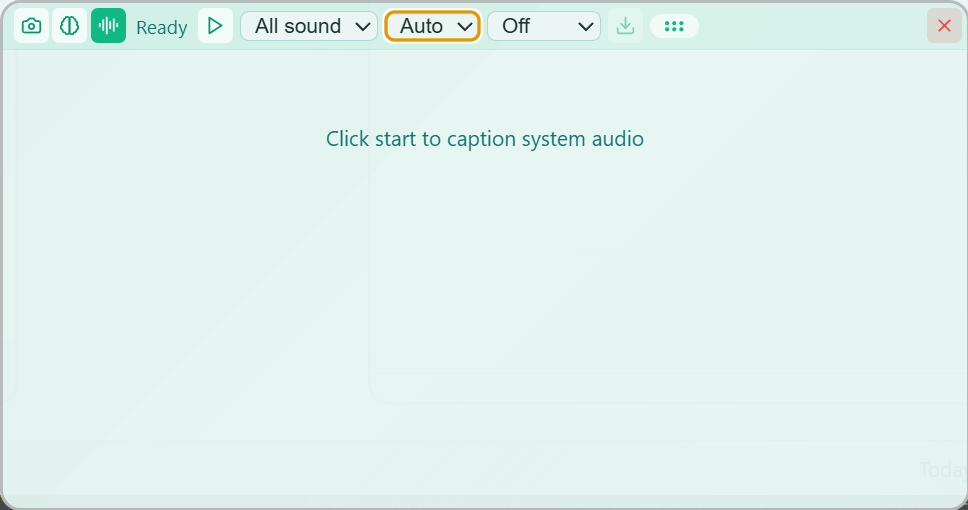

# T-Translate

<p align="right">
  <a href="./README.md">English</a> | 简体中文
</p>

<p align="center">
  
</p>

<p align="center">
  <strong>随手翻译，隐私无忧</strong><br>
  划词即译 · 截图即译 · 本地模型优先 · API Key 加密存储
</p>

<p align="center">
  
  
  
</p>

---

T-Translate 是一个 Windows 桌面翻译工具：在任何程序里选中文字就能翻译，截图能翻译，透明悬浮窗能盖在视频和游戏上实时翻译，电脑里正在播放的声音能变成字幕，PDF、Word、电子书能整本翻译。

它把隐私放在第一位：程序自带本地模型，模型文件放进文件夹就能离线翻译；所有 API 密钥用 Windows 系统加密保存，不出这台电脑；离线模式下不发出任何网络请求。

## 功能一览

| 功能 | 说明 |
| --- | --- |
| **划词翻译** | 在任何程序里选中文字，点一下就翻译；卡片可固定 |
| **截图翻译** | 框选屏幕任意区域识别并翻译，多显示器可用 |
| **悬浮窗口** | 透明窗口盖在内容上，空格截译；自动刷新盯住直播字幕，不抢焦点 |
| **听译** | 实时转写电脑正在播放的声音并逐句翻译，识别在本机，音频不落盘；字幕自动保存 |
| **文档翻译** | PDF、Word、EPUB、TXT、Markdown、SRT、VTT、CSV、JSON 九种格式，逐段翻译，进度可恢复 |
| **本地模型** | 程序自带 Qwen3-1.7B，文件放进文件夹就能翻译和总结，不用装别的软件 |
| **AI 动作** | 长文总结、段落讲解、悬浮窗讲解模式；可导入自定义动作 |
| **术语库与风格库** | 术语自动沿用你的译法；按参考文本改写译文语气 |
| **朗读** | 系统语音、本机神经语音包或外接服务，听译字幕可逐句朗读 |
| **134 种语言** | 覆盖 Google 翻译支持的全部语言，还能自己添加 |
| **11 个翻译源** | 内置模型、LM Studio、Ollama、OpenAI、Claude、Gemini、DeepSeek、DeepL、Google、Microsoft、百度 |
| **三种隐私模式** | 标准 / 无痕 / 离线，一键切换 |

---

### 划词翻译

选中任意文字，旁边出现小图标，点一下就是翻译卡片。拖动卡片可以固定住，最多同时固定 8 个；打开 CapsLock 直出模式后连图标都不用点。

<p align="center">
  
</p>

### 截图翻译

按 Alt+Q 框选屏幕区域，识别文字并翻译。本地引擎内置中、英、日和拉丁语系语言，韩文、西里尔、天城文、阿拉伯字母等按需下载语言包；引擎读不出时自动换下一个。

<p align="center">
  
</p>

### 悬浮窗口

透明窗口盖在想看的内容上，按空格翻译窗口下面的文字。译文可以散点贴在原位置（界面、漫画），也可以合成一段（文章）。开自动刷新后盯住直播字幕循环翻译，全程不抢焦点；鼠标穿透让点击直接落到下面的程序上。

<p align="center">
  
</p>

### 听译

悬浮窗切到「听译」，实时转写电脑正在播放的声音并逐句翻译。识别在本机完成，音频只在内存里过一遍。可以只听某一个程序（Windows 11），停止时字幕自动保存成 SRT。

<p align="center">
  
</p>

### 文档翻译

拖入文件逐段翻译，支持并发、扫描件 OCR、术语库联动，翻译到一半关掉下次接着来。每段可以让 AI 讲解，讲解过的段落可以汇总成总结；翻译完还能对照术语库检查用词。资源管理器里右键 PDF、Word、TXT 直接打开。

<p align="center">
  
</p>

### 隐私模式

标准模式功能全开；无痕模式什么都不保存；离线模式完全不联网，只用本机的翻译源和识别引擎，在线 API 密钥连解密都不做。换电脑用迁移包带走设置、术语库和收藏。

<p align="center">
  
</p>

### 多翻译源

内置模型、LM Studio、Ollama、OpenAI、Claude、Gemini、DeepSeek、DeepL、Google 翻译、Microsoft 翻译、百度翻译，拖动排序，一个失败自动换下一个。

<p align="center">
  
</p>

### 朗读

翻译结果可以朗读：系统语音零下载，神经语音包本机合成更自然，外接服务能接任何 OpenAI 兼容的语音接口。听译字幕逐句可读，读的时候自动暂停收音。

<p align="center">
  
</p>

---

## 安装

从 [Releases](https://github.com/Tianao0110/T-Translate/releases) 下载安装包（Windows x64）。装好后程序里有完整的使用说明：设置 → 使用说明；GitHub 上是同一份 [docs/MANUAL.zh.md](docs/MANUAL.zh.md)。

从源码构建：

```bash
git clone https://github.com/Tianao0110/T-Translate.git
cd T-Translate
npm install
npm run ocr:models      # 拉取本地 OCR 基础模型（一次性，约 19MB）
npm run llama:runtime   # 拉取钉版 llama.cpp 运行时（一次性，约 34MB）
npm start               # 开发模式
npm run dist            # 打包安装程序
```

## 模型

程序本身不带模型。语言包、听译识别模型、语音包在设置页里一键下载；下面几个大文件不经我们的服务器分发，自己下载后放进模型文件夹即可（位置在 设置 → 关于 → 存储）：

- 内置模型 Qwen3-1.7B（通用，1.8 GB）：[官方](https://huggingface.co/Qwen/Qwen3-1.7B-GGUF/resolve/main/Qwen3-1.7B-Q8_0.gguf) · [镜像](https://hf-mirror.com/Qwen/Qwen3-1.7B-GGUF/resolve/main/Qwen3-1.7B-Q8_0.gguf) → `models\llm-models`
- 内置模型 Hy-MT2-1.8B（仅翻译，1.9 GB）：[官方](https://huggingface.co/tencent/Hy-MT2-1.8B-GGUF/resolve/main/Hy-MT2-1.8B-Q8_0.gguf) · [镜像](https://hf-mirror.com/tencent/Hy-MT2-1.8B-GGUF/resolve/main/Hy-MT2-1.8B-Q8_0.gguf) → `models\llm-models`
- 内置视觉模型 PaddleOCR-VL-1.6（两个文件，各 0.9 GB，需显卡加速）：[主模型](https://huggingface.co/PaddlePaddle/PaddleOCR-VL-1.6-GGUF/resolve/main/PaddleOCR-VL-1.6-GGUF.gguf) · [图像编码器](https://huggingface.co/PaddlePaddle/PaddleOCR-VL-1.6-GGUF/resolve/main/PaddleOCR-VL-1.6-GGUF-mmproj.gguf) → `models\llm-models`
- 高精度听译模型 Qwen3-ASR（806 MB）：[下载](https://github.com/k2-fsa/sherpa-onnx/releases/download/asr-models/sherpa-onnx-qwen3-asr-0.6B-int8-2026-03-25.tar.bz2)，解压后整个文件夹放进 `models\asr-models`

镜像链接、放好后怎么检测、程序内下载不了时的备选地址，见使用说明第 5 章。

## 文档

| 文档 | 内容 |
| --- | --- |
| [使用说明](docs/MANUAL.zh.md) / [User Guide](docs/MANUAL.en.md) | 面向用户的完整说明，程序内也能看 |
| [FAQ](docs/FAQ.md) | 出错时看这里 |
| [ARCHITECTURE](docs/ARCHITECTURE.md) | 架构、目录结构、隐私分层 |
| [DEVELOPMENT](docs/DEVELOPMENT.md) | 新增翻译源 / OCR 引擎 / AI 动作 / 语言 |
| [T-ENGINE](docs/T-ENGINE.md) | 引擎接入层维护手册 |
| [OCR_MODELS](docs/OCR_MODELS.md) | OCR 模型与语言包发布 |
| [I18N_GUIDE](docs/I18N_GUIDE.md) | 国际化 |
| [THEME_CUSTOMIZATION](docs/THEME_CUSTOMIZATION.md) | 主题定制 |
| [MAINTENANCE](docs/MAINTENANCE.md) | 年度维护清单：哪些地方要查、年度模型评估 |
| `docs/design/` | 各功能的设计说明与踩坑记录 |

## 贡献

欢迎提交 Issue 和 Pull Request。

## 许可证

[T-Translate 许可协议 1.0](LICENSE)（源码开放，中文文本为准）——三句话版本：

- **随便用、随便改**：个人 / 团队 / 商业环境使用、修改、分发全部免费
- **永远免费**：本软件及任何包含其代码的修改版（含修改者新增的功能）不得以任何形式收费——禁止售卖、收费下载、内购、打赏解锁、收费分享；商业售卖请[联系作者](https://github.com/Tianao0110/T-Translate)洽谈授权
- **保留署名**：修改版须标明"基于 T-Translate 修改"并附原项目地址，不得声称原创

教程/评测内容变现、有偿部署等技术服务、不与功能挂钩的自愿捐赠均不受限制。第三方依赖按各自原协议授权（见 [NOTICE](NOTICE)）。v0.3.0 及更早版本按当时的 MIT 协议发布不受影响。

---

<p align="center">
  Made with ❤️ by <a href="https://github.com/Tianao0110">Edan Zeng</a>
</p>
